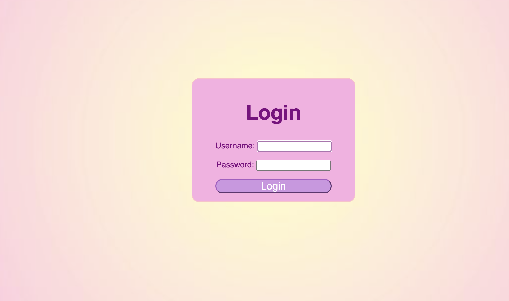
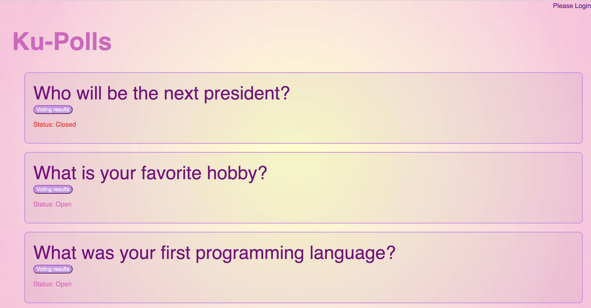
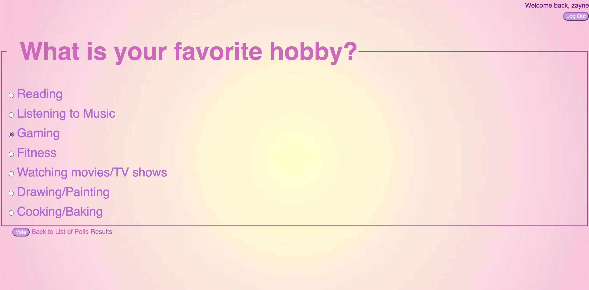
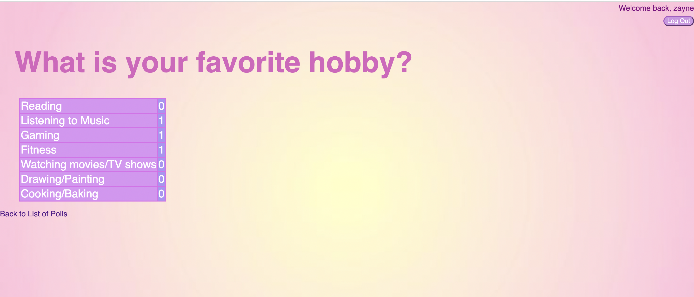

## KU Polls: Online Survey Questions 

[](../../actions/workflows/django.yml)

An application to conduct online polls and surveys based
on the [Django Tutorial project](https://docs.djangoproject.com/en/5.1/intro/tutorial01/), with
additional features.

This app was created as part of the [Individual Software Process](
https://cpske.github.io/ISP) course at [Kasetsart University](https://www.ku.ac.th).

## Requirements

Recommend python 3.11 and see the [requirements](./requirements.txt) 

## Installation

Follow this instruction: [Installation](./Installation.md)

## Running the Application

1. Activate the virtual environment
    ```
    # on Mac/Linux
    source venv/bin/activate
    
    # on Window
    venv\Scripts\activate 
    ```
2. Start Django Development server
    ```
   # Recommended python version >= 3.11
    python manage.py runserver
    ```
If the port is not available, you can kill the port by following these steps:
   ```
   # Find the process using port 8000 on Mac/Linux
   sudo lsof -i :8000
   
   #kill the port using PID
   sudo kill -9 PID
   ```
   ```
   # Find the process using port 8000 on Window
   netstat -ano | findstr :8000
   
   #kill the port using PID
   taskkill /PID PID /F
   ```
3. Access the server on your browser http://127.0.0.1:8000/

## UI 





## Admin
| Username | Password  |
|----------|-----------|
| admin    | hackme123 |

## Demo Users
| Username | Password |
|----------|----------|
| demo1    | hackme11 |
| demo2    | hackme22 |
| demo3    | hackme33 |

## Project Documents

All project documents are in the [Project Wiki](../../wiki/Home).

- [Vision Statement](../../wiki/Vision%20Statement)
- [Requirements](../../wiki/Requirements)
- [Project Plan](../../wiki/Project%20Plan)
- [Iteration 1](../../wiki/Iteration-1-Plan)
- [Iteration 2](../../wiki/Iteration-2-Plan)
- [Iteration 3](../../wiki/Iteration-3-Plan)
- [Iteration 4](../../wiki/Iteration-4-Plan)

## Task Board 
- [Iteration 1](https://github.com/users/yxzuz/projects/1/views/1)
- [Iteration 2](https://github.com/users/yxzuz/projects/1/views/3)
- [Iteration 3](https://github.com/users/yxzuz/projects/1/views/12)
- [Iteration 4](https://github.com/users/yxzuz/projects/1/views/13)
